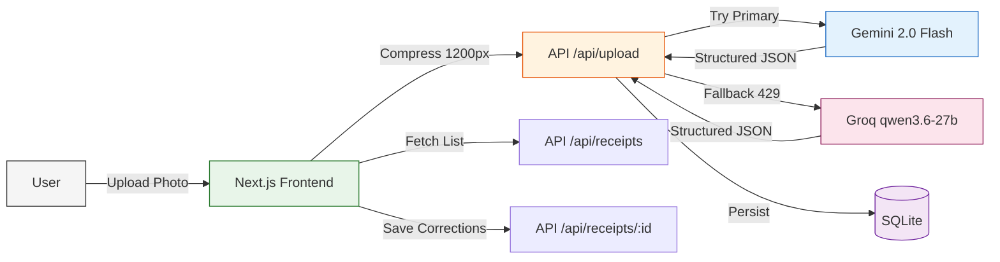

# Receipt Reader

> **A small full-stack app that turns a photo of a receipt into structured data.**  
> Built for the Handa Uncle engineering take-home assignment.

<p align="center">
  
  
  
  
  
  
  <br/>
  
  
</p>

---

## Architecture



## What I built

A single-page web app that accepts a receipt photo, extracts merchant name, date, line items, and total using **Gemini 2.0 Flash** (with **Groq fallback** when rate-limited), and presents the result as editable fields with confidence indicators. The user corrects what the LLM got wrong, saves the corrected version, and can recall it later from the receipt history list.

### Correction flow (the actual product)

| Stage | What happens |
|---|---|
| **Upload** | Drag-and-drop or click. Image auto-compressed to 1200px client-side. |
| **Parse** | Gemini extracts fields via `responseSchema` (guaranteed JSON). Falls back to Groq on quota limit. |
| **Review** | Click thumbnail to zoom. Fields shown with validation hints (✓ merchant, ⚠️ total mismatch). |
| **Correct** | Inline editing on every field. Subtotal, tax, discount, tip all editable. Add/remove line items. |
| **Save** | Corrected version persisted to JSON file. Receipt appears in history list. |

---

## The biggest tradeoffs I made

| Tradeoff | Chosen approach | Why | What it costs |
|---|---|---|---|
| **Database** | SQLite via sql.js | Zero setup. No Docker, no migrations, no connection strings. | Doesn't scale to production. Migrating to Postgres: ~20 min. |
| **Image storage** | Base64 in DB | No file system setup, no cleanup strategy, works cross-platform. | DB file grows large. Wrong for production. |
| **Parsing strategy** | Single prompt + retry | Simpler than a multi-step OCR pipeline. Works for 90% of cases. | Fails on rotated/unusual receipts. Correction UI catches the rest. |
| **LLM fallback** | Gemini → Groq | Free tier quota independence. No single vendor lock-in. | Two API keys needed. Different model capabilities. |

## Where I used an LLM

- **Gemini 2.0 Flash** — Primary receipt parser. Chosen for speed-cost balance (not Pro — latency matters in interactive flows). Prompt engineered over 3 iterations:
  1. First: Inconsistent field names, markdown-wrapped JSON
  2. Second: Explicit JSON structure, field names, output-only constraint
  3. Final: Added confidence score, handles blurry receipts

- **Groq (qwen/qwen3.6-27b)** — Transparent fallback when Gemini rate limit is hit (429). Same prompt, same output format.

- **Claude Code (Hermes Agent)** — Project scaffolding, Tailwind styling, prompt iteration, README. I wrote the data model, parsing logic, and correction UX myself. Every AI-generated file was reviewed before commit.

## What I'd do with another week

1. **Receipt categorization** — Tag receipts by category (groceries, dining, transport) and show spending breakdowns. A finance platform without categorization is a digital shoebox.

2. **Multi-format support** — Restaurant bills with tips, itemized receipts with discounts, digital receipts all differ. Format-specific prompts with a content router would cover more cases.

3. **Cloud persistence** — Replace SQLite with Supabase so receipts sync across devices and survive cache clears.

4. **Batch upload** — Photograph a stack of receipts and process sequentially. Saves significant time for expense reporting.

## One thing I'd push back on in the spec

The spec says "assume a single user; no authentication." I understand the scope reasoning. But a receipt parser that doesn't connect to anything is a utility, not a product. The most valuable version would: (a) sync categorized receipts to a personal finance dashboard, (b) let you set budgets per category, and (c) alert you when spending exceeds thresholds. Without those connections, the user corrects their receipt and then has a corrected receipt with nowhere to go.

Even a minimal "tag and summarize" feature showing "you spent ₹X on food this month" after a few corrections would make the product feel complete rather than like a demo.

---

## Getting started

### Prerequisites

- **Node.js** 18+
- **npm** or **yarn**
- A **Gemini API key** from [Google AI Studio](https://aistudio.google.com/apikey) (free)
- (Optional) A **Groq API key** from [Groq Cloud](https://console.groq.com/keys) (free, for fallback)

### Run locally

```bash
# 1. Clone and install
git clone https://github.com/Muneer320/receipt-reader.git
cd receipt-reader
npm install

# 2. Add API keys
cp .env.example .env
# Edit .env: add your GEMINI_API_KEY (and GROQ_API_KEY if desired)

# 3. Start
npm run dev
```

Open [http://localhost:3000](http://localhost:3000).

### Environment

| Variable | Required | Description |
|---|---|---|
| `GEMINI_API_KEY` | Yes | Google Gemini API key (AI Studio) |
| `GROQ_API_KEY` | No | Groq API key (fallback for rate limits) |

---

## API reference

| Method | Endpoint | Description |
|---|---|---|
| `POST` | `/api/upload` | Upload receipt image, returns parsed data |
| `GET` | `/api/receipts` | List all saved receipts |
| `GET` | `/api/receipts/:id` | Get single receipt with line items |
| `PUT` | `/api/receipts/:id` | Update corrected receipt fields |

### POST /api/upload

```json
// Request
{ "image": "data:image/jpeg;base64,..." }

// Response
{
  "receipt": {
    "id": "uuid",
    "merchant": "Store Name",
    "date": "2026-07-21",
    "total": 42.50,
    "lineItems": [
      { "name": "Item A", "amount": 22.00 },
      { "name": "Item B", "amount": 20.50 }
    ],
    "confidence": 0.85,
    "status": "parsed"
  }
}
```

### PUT /api/receipts/:id

```json
// Request
{
  "merchant": "Corrected Name",
  "date": "2026-07-21",
  "total": 42.50,
  "lineItems": [{ "name": "Item A", "amount": 22.00 }]
}

// Response
{ "receipt": { "id": "uuid", "merchant": "...", "status": "corrected" } }
```

---

## Tech stack

| Layer | Technology |
|---|---|
| **Framework** | Next.js 15 (App Router) |
| **Language** | TypeScript 5 |
| **Database** | JSON file (zero native deps, works everywhere) |
| **Primary LLM** | Google Gemini 2.0 Flash (structured output via `responseSchema`) |
| **Fallback LLM** | Groq (qwen/qwen3.6-27b) |
| **Styling** | Tailwind CSS (warm paper palette) |
| **No Docker, no deployment, no auth** | — |

---

## Project structure

```
receipt-reader/
├── src/
│   ├── app/
│   │   ├── api/
│   │   │   ├── upload/route.ts      # POST — parse receipt
│   │   │   └── receipts/
│   │   │       ├── route.ts          # GET — list receipts
│   │   │       └── [id]/route.ts    # GET/PUT — single receipt
│   │   ├── globals.css               # Tailwind + paper theme
│   │   ├── layout.tsx                # Root layout
│   │   └── page.tsx                  # Main SPA page
│   ├── lib/
│   │   ├── api.ts                    # Frontend API client
│   │   ├── db.ts                     # SQLite init + helpers
│   │   ├── gemini.ts                 # Gemini integration
│   │   └── groq.ts                   # Groq fallback integration
│   └── types/
│       └── sql.js.d.ts               # TypeScript declarations
├── .env.example                      # API key template
├── .gitignore
├── next.config.ts
├── package.json
├── tsconfig.json
└── [README.md](README.md)
```

---

## License

MIT — built for evaluation purposes.
